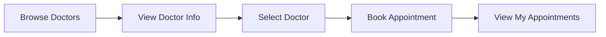
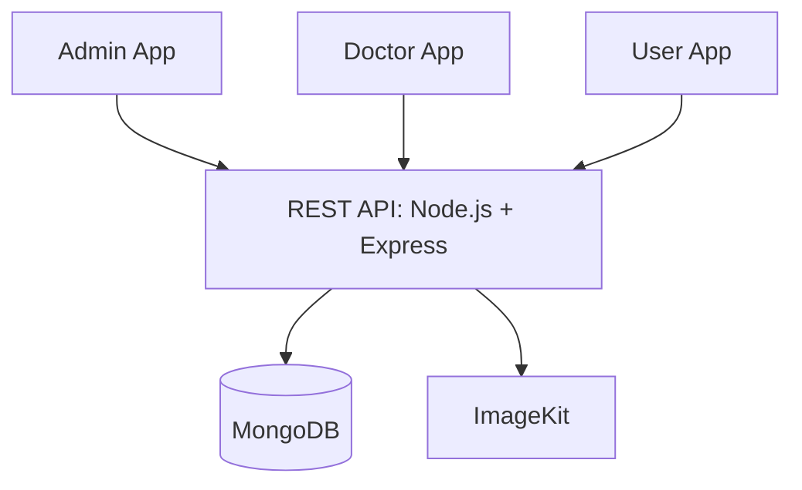
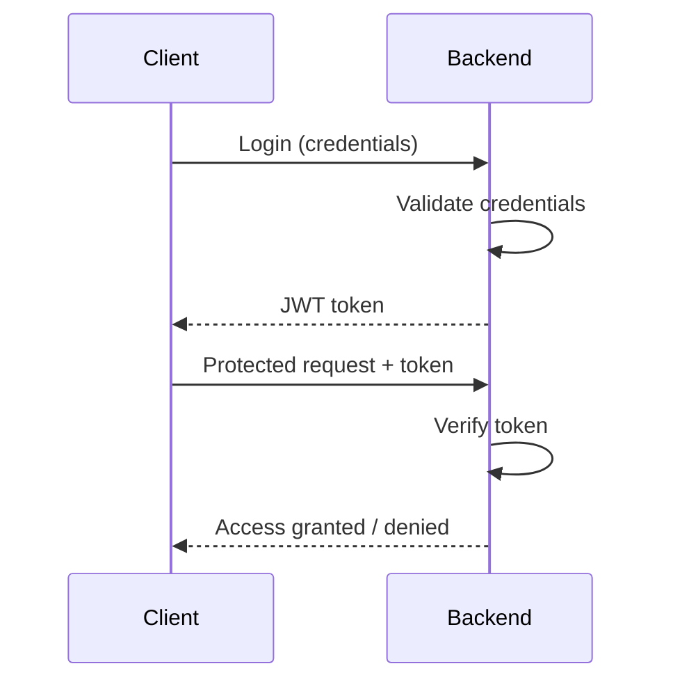
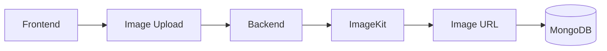

<!-- Animated Header -->
<p align="center">
  
</p>

<p align="center">
  
</p>

<p align="center">
  
  
  
  
  
  
  
</p>

<p align="center">
  <a href="https://doctor-appointment-system-p1zy.vercel.app/"></a>
  <a href="https://github.com/omar-rehann/Doctor-Appointment-System"></a>
</p>

<p align="center">
  <a href="#-features">Features</a> •
  <a href="#-screenshots">Screenshots</a> •
  <a href="#%EF%B8%8F-tech-stack">Tech Stack</a> •
  <a href="#%EF%B8%8F-architecture">Architecture</a> •
  <a href="#%EF%B8%8F-installation">Installation</a>
</p>

---

## 📖 Overview

A full-stack **Doctor Appointment and Healthcare Management System** for managing doctors, patients, medical services, specialties, and appointments through three separate platforms.

| 👨‍💼 Admin | 🩺 Doctor | 👤 User |
| --- | --- | --- |
| Manages doctors, services, specialties, users, and appointments | Has their own account to manage their information and appointments | Creates an account, browses doctors, and books appointments |

The app has a separate frontend (one app per role) and a shared REST backend.

---

## 🚀 Features

### 🔐 Authentication & Authorization

- User registration and login
- Separate Admin and Doctor authentication
- JWT authentication
- Role-based authorization
- Protected routes
- Logout

### 👥 Features by Role

| 👨‍💼 Admin | 🩺 Doctor | 👤 User |
| --- | --- | --- |
| Add, view, edit, delete **doctors** | Log in to own dashboard | Register, log in, log out |
| Upload doctor images, assign specialty | View own profile | Browse doctors and their info |
| Add experience, degree/college, address | View other doctors | View specialties and services |
| Manage doctor credentials | View specialties and services | **Book appointments** |
| Add, view, edit, delete **services** | View appointments | View own appointments |
| Add, view, edit, delete **specialties** | View daily appointments | Manage available appointment actions |
| View and manage **users** | Manage info within permissions | Contact page |
| View and manage **appointments** | Log out | |

### 🏥 Specialties

> Dentistry • Internal Medicine • ENT • Cardiology • Pediatrics • Dermatology • and more

### 📅 Appointment Flow



- **Doctors** can check their appointments and daily bookings.
- **Admins** can view and manage all appointment records.

### 🔁 CRUD Operations

Full Create / Read / Update / Delete for **Doctors, Services, Specialties, Users, and Appointments**.

---

## 📸 Screenshots

> Put your images inside a `screenshots/` folder with these names (or change the paths below).

### 👤 User Platform

| Home | Doctors | Booking |
| :---: | :---: | :---: |
|  |  |  |

### 👨‍💼 Admin Dashboard

| Dashboard | Doctors | Appointments |
| :---: | :---: | :---: |
|  |  |  |

### 🩺 Doctor Dashboard

| Dashboard | Appointments |
| :---: | :---: |
|  |  |

---

## 🛠️ Tech Stack

| Layer | Technologies |
| --- | --- |
| **Frontend** | <br/><sub>React Bootstrap • SweetAlert • Font Awesome</sub> |
| **Backend** | <br/><sub>REST APIs • JWT</sub> |
| **Database** | <br/><sub>Mongoose</sub> |
| **Services** |  |

---

## 🏗️ Architecture



### 🔑 Authentication Flow



### 🖼️ Image Upload Flow



### 🗄️ Main Entities

`Users` • `Doctors` • `Services` • `Specialties` • `Appointments`

---

## 📁 Project Structure

<details>
<summary><b>Show structure</b></summary>

```text
Doctor-Appointment-System/
├── Backend/
│   ├── controller/
│   ├── model/
│   ├── routes/
│   ├── middleware/
│   ├── uploads/
│   ├── server.js
│   └── package.json
├── Admin/
│   ├── app/
│   ├── components/
│   └── public/
├── Doctor/
│   ├── app/
│   ├── components/
│   └── public/
├── User/
│   ├── app/
│   ├── components/
│   └── public/
└── README.md
```

</details>

---

## ⚙️ Installation

**1. Clone the repository**

```bash
git clone https://github.com/omar-rehann/Doctor-Appointment-System.git
cd Doctor-Appointment-System
```

**2. Backend**

```bash
cd Backend
npm install
```

Create a `.env` file:

```env
PORT=4000
MONGODB_URI=your_mongodb_connection_string
JWT_SECRET=your_jwt_secret
IMAGEKIT_PUBLIC_KEY=your_imagekit_public_key
IMAGEKIT_PRIVATE_KEY=your_imagekit_private_key
IMAGEKIT_URL_ENDPOINT=your_imagekit_url
```

```bash
npm run server
```

**3. Frontend apps** (each in its own terminal)

| App | Commands |
| --- | --- |
| Admin | `cd Admin && npm install && npm run dev` |
| Doctor | `cd Doctor && npm install && npm run dev` |
| User | `cd User && npm install && npm run dev` |

> ⚠️ **Never upload your `.env` file to GitHub.** Add this to `.gitignore`:
>
> ```text
> .env
> node_modules
> .next
> ```

---

## ⚠️ Error Handling

Handled cases: invalid login credentials, missing required fields, invalid JWT, unauthorized requests, invalid appointment data, database errors, API errors, and image upload errors.

**SweetAlert** is used on the frontend for user-friendly notifications.

---

## 📱 Responsive Design

Works across desktop, laptop, tablet, and mobile using **Tailwind CSS**, **React Bootstrap**, and responsive layouts.

---

## 🔒 Security

- JWT authentication
- Protected API routes
- Role-based access
- Environment variables for sensitive configuration

---

## 🚧 Future Improvements

- [ ] 💳 Online payment integration
- [ ] 📧 Email notifications
- [ ] ⏰ Appointment reminders
- [ ] 🗓️ Doctor availability scheduling
- [ ] 🔎 Advanced search and filtering
- [ ] 📋 Patient medical records
- [ ] ⭐ Reviews and ratings
- [ ] 📊 Admin analytics dashboard
- [ ] 🔔 Real-time notifications
- [ ] ☁️ Cloud deployment optimization

---

## 👨‍💻 Author

<p align="center">
  <b>Omar Rehan</b><br/>
  Full-Stack Developer
</p>

<p align="center">
  <a href="https://github.com/omar-rehann"></a>
  <a href="https://www.linkedin.com/in/omar-rehann"></a>
  <a href="https://omar-rehann.github.io/Omar-Rehann/"></a>
</p>

<p align="center">
  
</p>